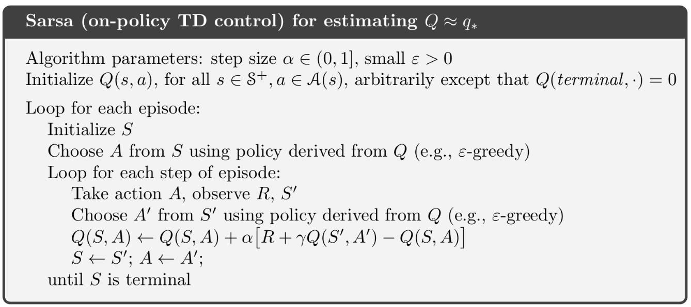
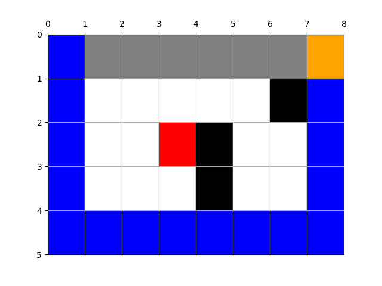

# Cliffwalk

Find a policy for cliff walk problem with SARSA and epsilon greedy.



## Usage

Just run the command in this folder to view the demonstration.
```bash
python3 cliffwalk.py
```

Or equivalently, import this file and run Python code like this:
```python
Env = Environment()
sarsa = Sarsa(Env)
policy = sarsa.learning(max_episode_num=300, gamma=0.9, alpha=0.1, epsilon=0.8)
Env.update_path(policy)
Env.show_env()
```

## Result

**Note that the result of SARSA and epsilon greedy depends on some randomness, so to better demonstrate it, I set the seed to `2019` for all random operations.**

Parameters are set as follows:

| Parameter | Value                                |
| --------- | ------------------------------------ |
| Episode   | 300                                  |
| Epsilon   | 0.8, halves after every 100 episodes |
| Alpha     | 0.1                                  |
| Gamma     | 0.9                                  |

Then the final policy is (0, 1, 2 and 3 stand for up, down, left and right):

| 1    | 1    | 1    | 1    | 1    | 1    | 3    | 1    |
| ---- | ---- | ---- | ---- | ---- | ---- | ---- | ---- |
| 1    | 1    | 1    | 1    | 2    | 1    | 0    | 0    |
| 1    | 1    | 1    | 1    | 0    | 3    | 3    | 0    |
| 1    | 1    | 1    | 1    | 1    | 1    | 3    | 0    |
| 3    | 3    | 3    | 3    | 3    | 3    | 3    | 0    |

And accordingly, it produces a path:


