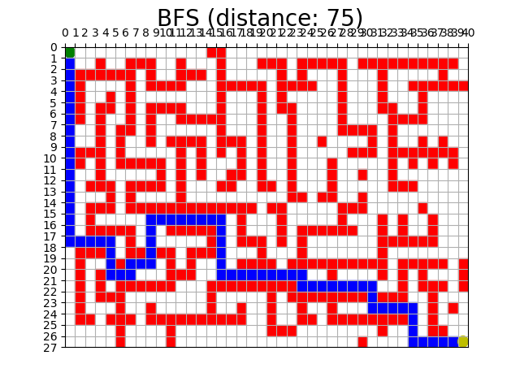
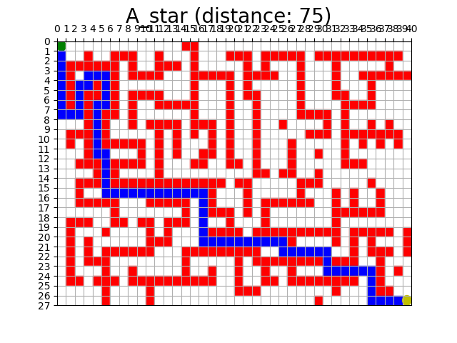

# Maze
Algorithms to find the optimal path in a maze.

## Usage
Just run the command in this folder to view the demonstration.
```bash
python3 maze.py
```

Or equivalently, import this file and run Python code like this:
```python
Solution = MazeProblem(maze_file='maze.txt')
algorithms = ["BFS", "A_star"]
for algo in algorithms:
    Solution.solve(algo)
    Solution.drawMap(algo)
```

## Result

For BFS, one of the optimal paths is:



For A\*, one of the optimal paths is:


